# Predizione della sopravvivenza nei disastri marittimi storici
## Gruppo
- Anno: 2025/2026
- Gruppo: 10
- Membri: (Nome, cognome, matricola)
    - Emanuele, Di Benedetto, 1000031016 
    - Davide, Greco, 1000099238
    - Samuele, Moscuzza, 1000016511

## Abstract
L'obiettivo del progetto è sviluppare e valutare modelli predittivi per stimare la sopravvivenza dei passeggeri coinvolti in disastri navali storici, tra cui il Titanic, l'Estonia e il Lusitania. I dati sono stati sottoposti ad una fase di preprocessing, durante la quale è stato costruito un insieme di feature uniformi

`['survived', 'sex', 'age', 'age_missing', 'class', 'crew']`,

normalizzando tutte le variabili e combinando i tre dataset originali in un unico dataset integrato.

Sono stati confrontati diversi modelli di classificazione: regressione logistica, Multi-layer Perceptron (MLP), classificatore Softmax e Support Vector Machine (SVM), ponendo particolare attenzione al problema dello sbilanciamento delle classi.

I risultati mostrano come i modelli non bilanciati tendano a predire prevalentemente la classe maggioritaria, ottenendo valori di accuracy elevati ma recall molto basso. L'introduzione di pesi nelle funzioni di loss ha migliorato significativamente la capacità di identificare la classe positiva.

Tra i modelli analizzati, il **DeepMLP** ha ottenuto le migliori prestazioni complessive, con un buon equilibrio tra accuracy (~62%), recall (~78%) ed F1-score (~57%). Anche il modello MLP base ha mostrato risultati compatibili, mentre la regressione logistica con `BCEWithLogitsLoss` ha evidenziato un recall elevato (~74%) a fronte di una riduzione dell'accuracy.

Questi risultati evidenziano l'importanza del bilanciamento delle classi e il ruolo delle architetture non lineari nella modellazione del problema.

## Introduzione
Il presente progetto nasce con l’obiettivo di applicare tecniche di Machine Learning all'analisi di dati storici relativi a incidenti navali, con lo scopo di stimare la probabilità di sopravvivenza dei passeggeri e dei membri dell'equipaggio coinvolti. Il problema affrontato rientra nell’ambito della classificazione binaria, poiché la variabile di interesse assume due soli valori possibili: sopravvissuto o non sopravvissuto. Attraverso l’analisi dei dati disponibili, il progetto mira a evidenziare come alcune caratteristiche individuali e di contesto possano influenzare in modo significativo l’esito finale di un evento catastrofico.

L'interesse principale di questo lavoro è duplice. Da un lato si vuole comprendere il ruolo giocato da fattori socio-demografici e funzionali, come la classe di viaggio, il sesso e la mansione svolta a bordo, nella determinazione delle probabilità di sopravvivenza. Dall’altro lato, il progetto si propone di progettare, addestrare e confrontare diversi modelli predittivi, valutandone prestazioni, limiti e affidabilità in un contesto reale e complesso.

L'analisi di eventi storici di questo tipo consente inoltre di riflettere su aspetti sociali ed etici rilevanti. In situazioni di emergenza, fattori come l'accesso ai mezzi di salvataggio, le decisioni prese in condizioni di forte stress e le differenze sociali possono influenzare in modo significativo le probabilità di sopravvivenza. L’utilizzo di modelli predittivi permette di formalizzare queste osservazioni e di trasformarle in conoscenza quantitativa, rendendo possibile un’analisi sistematica delle dinamiche che caratterizzano tali eventi.

Il progetto prende come riferimento alcuni tra i più noti incidenti navali della storia moderna, scelti per la loro rilevanza storica e per la disponibilità di dati utili all’analisi.

Il naufragio del RMS Titanic, avvenuto nella notte tra il 14 e il 15 aprile 1912 durante il viaggio inaugurale da Southampton a New York, rappresenta uno dei casi di studio più emblematici. Il Titanic era considerato un simbolo del progresso tecnologico dell'epoca e ritenuto virtualmente inaffondabile. Tuttavia, la collisione con un iceberg portò a un disastro che mise in luce profonde differenze nelle probabilità di sopravvivenza tra i passeggeri. La classe di viaggio ebbe un ruolo determinante, così come il sesso, influenzato dalla prassi non ufficiale di dare priorità a donne e bambini.

Un secondo evento di grande importanza è il naufragio del MS Estonia, avvenuto nel Mar Baltico il 28 settembre 1994. A differenza del Titanic, l'Estonia operava in un'epoca caratterizzata da sistemi di sicurezza più moderni e regolamentazioni più stringenti. Nonostante ciò, il cedimento del portellone di prua in condizioni meteorologiche avverse portò a un affondamento rapido e a un numero molto elevato di vittime. In questo caso, la velocità con cui si sviluppò l'incidente ridusse drasticamente le possibilità di evacuazione.

Infine, l'affondamento del RMS Lusitania, avvenuto il 7 maggio 1915 durante la Prima Guerra Mondiale, costituisce un esempio di disastro navale in un contesto bellico. La nave fu colpita da un siluro lanciato da un sottomarino tedesco e affondò in tempi estremamente rapidi. In una situazione di questo tipo, la gestione dell'emergenza risultò fortemente compromessa dall'assenza di preavviso e dalle condizioni di guerra.

Dal punto di vista metodologico, il lavoro si articola in diverse fasi. In primo luogo viene effettuato il preprocessing dei dataset, uniformando e combinando i dati provenienti da diversi incidenti navali in un unico dataset coerente. Successivamente vengono addestrati e confrontati diversi modelli di classificazione, tra cui regressione logistica, Support Vector Machine (SVM), classificatore Softmax e Multilayer Perceptron (MLP). Infine, le prestazioni dei modelli vengono valutate attraverso metriche standard come accuracy, precision, recall e F1-score.

## Dataset
Il dataset utilizzato in questo progetto raccoglie informazioni relative ai passeggeri coinvolti in alcuni tra i più noti incidenti navali della storia moderna: il naufragio del RMS Titanic (1912), quello del MS Estonia (1994) e l'affondamento del RMS Lusitania (1915).

L'obiettivo del dataset è fornire un insieme di caratteristiche dei passeggeri che possano essere utilizzate per addestrare un modello di classificazione binaria, in grado di prevedere la probabilità di sopravvivenza in base alle informazioni disponibili.

Il dataset finale è stato ottenuto tramite la formattazione e la concatenazione di tre dataset distinti, uno per ciascun incidente navale.
Complessivamente sono presenti **3841 record** e **6 feature** di natura eterogenea, comprendenti sia dati numerici sia dati categorici descritti nella **Tabella 1**.

    <table align="center">
        <thead>
            <tr>
                <th>Feature</th>
                <th>Tipo</th>
                <th>Descrizione</th>
            </tr>
        </thead>
        <tbody>
            <tr>
                <td>survived</td>
                <td>binaria</td>
                <td>variabile target che indica la sopravvivenza</td>
            </tr>
            <tr>
                <td>sex</td>
                <td>binaria</td>
                <td>sesso del passeggero</td>
            </tr>
            <tr>
                <td>age</td>
                <td>numerica</td>
                <td>età del passeggero</td>
            </tr>
            <tr>
                <td>age_missing</td>
                <td>binaria</td>
                <td>flag che indica se l'età è mancante</td>
            </tr>
            <tr>
                <td>class</td>
                <td>classe del biglietto</td>
                <td>categorica</td>
            </tr>
            <tr>
                <td>crew</td>
                <td>categorica</td>
                <td>ruolo a bordo</td>
            </tr>
        </tbody>
    </table>
    <i>Tabella 1: Tipo e descrizione delle variabili presenti nel dataset finale</i>

I tre dataset relativi ai disastri navali sono stati raccolti da fonti pubbliche disponibili online sulla piattaforma [Kaggle](https://kaggle.com).

In particolare, i dataset utilizzati sono disponibili ai seguenti link:
- [RMS Titanic](https://www.kaggle.com/datasets/abdelrahmansaad10/titanic)
- [MS Estonia](https://www.kaggle.com/datasets/christianlillelund/passenger-list-for-the-estonia-ferry-disaster)
- [RMS Lusitania](https://www.kaggle.com/datasets/rkkaggle2/rms-lusitania-complete-passenger-manifest)

Questi dataset contengono informazioni sui passeggeri coinvolti nei rispettivi incidenti navali e sono stati utilizzati come base per la costruzione del dataset finale utilizzato nel progetto.

L'acquisizione del dataset finale utilizzato per l'addestramento dei modelli è stata effettuata tramite i notebooks `merge_dataset.ipynb` e `dataset_stats.ipynb`.

Il primo notebook descrive il processo di acquisizione dei dati dai tre dataset originali, nonchè le operazioni di uniformazione e integrazione necessarie per ottenere un unico dataset utilizzabile per l'addestramento dei modelli di apprendimento automatico.
Il secondo notebook presenta invece un'analisi esplorativa dei dataset, finalizzata ad individuare le variabili più rilevanti per il problema affrontato e a produrre diversi grafici riassuntivi delle caratteristiche dei dati.

Lo strumento principale utilizzato per la manipolazione e l'analisi dei dati è stata la libreria Python `pandas`.

I dataset sono stati scaricati dalle rispettive fonti in formato CSV `.csv` e successivamente analizzati, in quanto presentavano strutture e variabili differenti tra loro.

Tra le variabili disponibili, lo stato di sopravvivenza è stato scelto come variabile target, mentre come feature di input sono state selezionate l'età, il sesso, la classe di viaggio e il ruolo a bordo.

Sono state invece escluse alcune variabili considerate meno rilevanti ai fini della previsione della sopravvivenza, tra cui il nome, costo del biglietto, nazionalità, porto d'imbarco, cittadinanza e stato civile.

Durante questa fase sono emerse alcune difficoltà legate all'eterogeneità delle informazioni disponibili nei diversi dataset. In particolare, nel dataset relativo al RMS Titanic non è presente l'informazione relativa al ruolo a bordo, mentre nei dataset relativi ad MS Estonia e al RMS Lusitania non risulta disponibile la classe del biglietto.

Il preprocessing effettuato prevede le seguenti operazioni sulle variabili del dataset:
- Variabile `survived`: viene creata copiando il valore numero `0` (non sopravvissuto) e `1` (sopravvissuto) se disponibile. Nei casi in cui la variabile sia espressa in forma testuale, come nel dataset del RMS Lusitania dove i valori sono `lost` e `saved`, questi vengono mappati rispettivamente a `0` ed `1`.
- Variabile `sex`: le stringhe `male` e `female`, o le abbreviazioni `m` ed `f`, vengono mappate nei valori numerici `0` (maschio) ed `1` (femmina).
- Variabile `age`: viene mantenuto il valore numerico originale. In presenza di valori mancanti, questi vengono sostituiti con la mediana dell'età dei passeggeri e viene impostata la variabile `age_missing = 1` come **flag** per indicare al modello che il valore originale non è disponibile.
- Variabile `class` (classe del biglietto): se il valore non è disponibile viene assegnato `0`; altrimenti viene utilizzato il corrispettivo valore numerico della classe (1 = prima classe, 2 = seconda classe, 3 = terza classe).
- Variabile `crew` (ruolo a bordo): viene codificata come `1` se il soggetto è membro dell'equipaggio e `0` se passeggero. In assenza di informazioni, viene utilizzato il valore `-1`.

Successivamente, prima dell'addestramento dei modelli, i dati vengono suddivisi in training set e test set e normalizzati. La suddivisione è effettuata tramite la funzione `train_test_split` della libreria `scikit-learn` impostando il parametro `test_size = 0.2`, ottenendo uno split del **80%** per il training set e del **20%** nel test set. Per garantire che la distribuzione delle classi sia rappresentata in entrambi i set, viene impostato il parametro `stratify = Y`, dove `Y` corrisponde alle etichette di sopravvivenza. Ad esempio, se le etichette sono suddivise in 70% per `0` e 30% per `1`, lo stesso rapporto verrà mantenuto sia nel training set sia nel test set.

La normalizzazione delle variabili numeriche del training set viene effettuata tramite standardizzazione (z-score), definita come:
$$
X_{norm} = \frac{X - \mu}{\sigma}
$$
dove $\mu$ e $\sigma$ rappresentano rispettivamente la media e la deviazione standard di $X$.

Tra i grafici riassuntivi dei dati calcolati nel notebook `dataset_stats.ipynb` è presente l'analisi della distribuzione della variabile target `survived`, che indica se un passeggero è sopravvissuto o meno all'incidente navale.

Il grafico in **Figura 1** mostra il numero di passeggeri sopravvissuti e non sopravvissuti presenti nel dataset complessivo.

    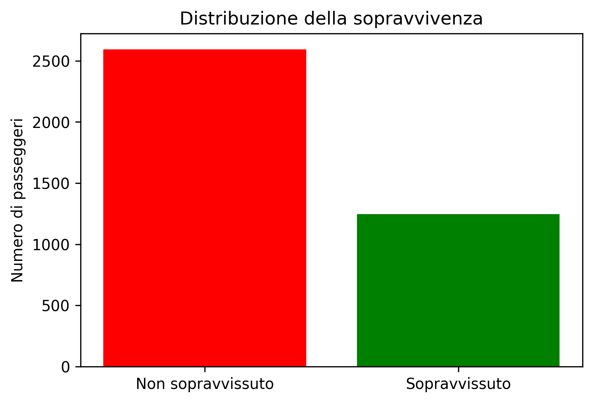
     
    <i>Figura 1: Distribuzione della sopravvivenza dei passeggeri</i>

Questo tipo di analisi è utile per verificare se il dataset presenta sbilanciamento tra classi, che potrebbe influenzare l'addestramento dei modelli di classificazione. L'analisi evidenzia effettivamente una maggiore presenza della classe `0` (passeggeri non sopravvissuti) con il **67.53%** dei record totali nel dataset.

Successivamente è stata analizzata la distribuzione del sesso dei passeggeri. Come mostrato in **Figura 2**, la popolazione del dataset è composta per circa il **66%** da passeggeri di sesso maschile e per circa il **33%** di passeggeri di sesso femminile.

    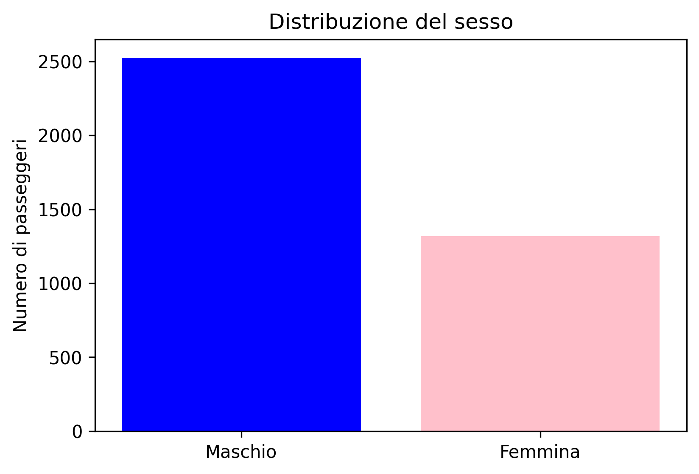
     
    <i>Figura 2: Distribuzione del sesso dei passeggeri</i>

Un'ulteriore analisi riguarda la distribuzione della sopravvivenza in funzione del sesso dei passeggeri, riportata in **Figura 3**.

    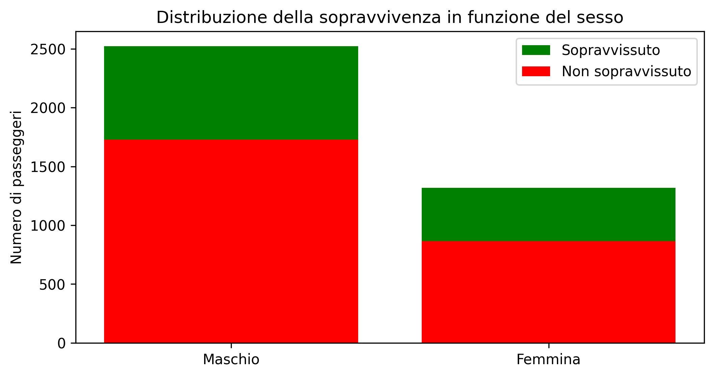
     
    <i>Figura 3: Distribuzione della sopravvivenza in funzione del sesso dei passeggeri</i>

Nel caso del naufragio del RMS Titanic era presente il noto protocollo informale "prima le donne e bambini" (**Figura 3.1**), che portava a dare priorità alle donne nelle operazioni di evacuazione. Tuttavia, poiché il dataset include anche i disastri navali del RMS Lusitania e del MS Estonia (**Figura 3.2 e Figura 3.3**), questo effetto risulta meno marcato nel dataset complessivo. Infatti le percentuali di sopravvivenza risultano relativamente simili tra i due sessi, con circa il **31%** dei passeggeri maschi sopravvissuti e circa il **34%** delle passeggere femmine.

<table align="center">
    <tr>
        <td align="center">
            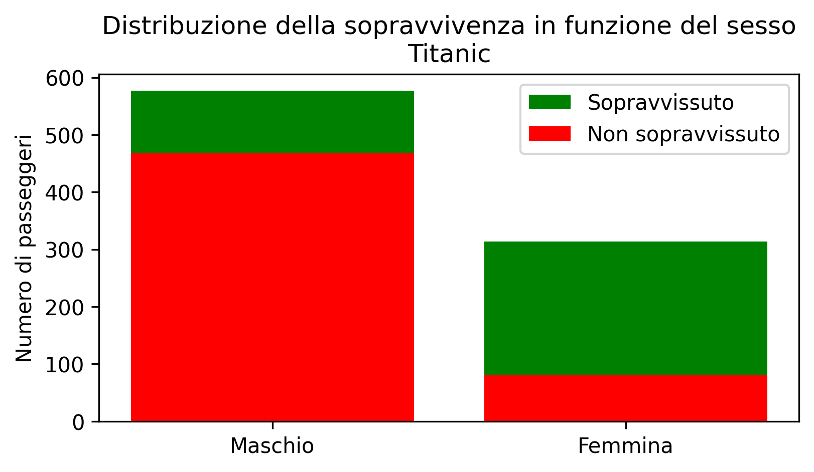 
            <i>Figura 3.1: Distribuzione della sopravvivenza in funzione del sesso dei passeggeri del RMS Titanic</i>
        </td>
        <td align="center">
            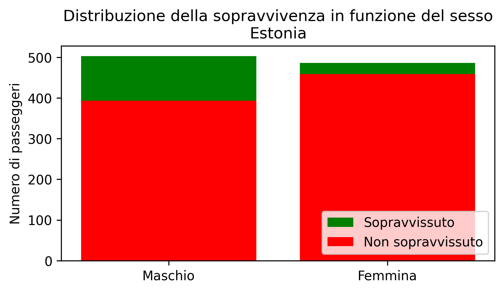 
            <i>Figura 3.2: Distribuzione della sopravvivenza in funzione del sesso dei passeggeri del MS Estonia</i>
        </td>
        <td align="center">
            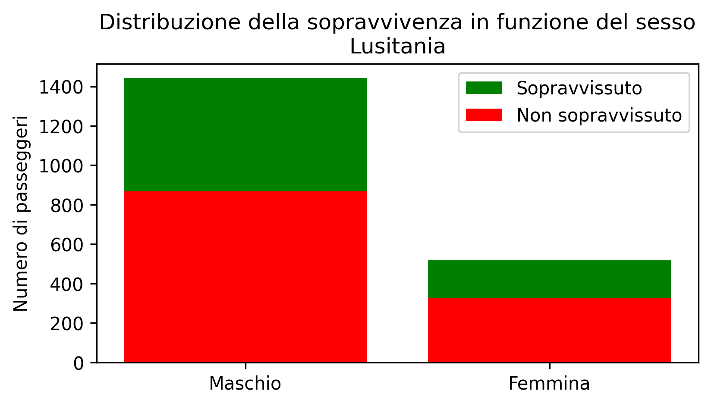 
            <i>Figura 3.3: Distribuzione della sopravvivenza in funzione del sesso dei passeggeri del RMS Lusitania</i>
        </td>
    </tr>
</table>

Un'altra caratteristica rilevante per l'analisi dei passeggeri è rappresentata dall'età. La **Figura 4** mostra la distribuzione dell'età nel dataset, mentre la **Figura 4.1** riporta la distribuzione della sopravvivenza in funzione dell'età dei passeggeri.

<table align="center">
    <tr>
        <td align="center">
            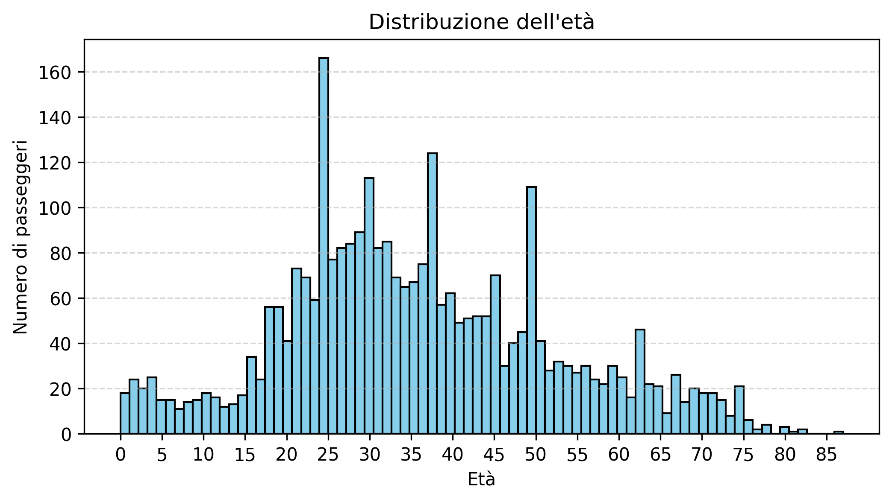 
            <i>Figura 4: Distribuzione dell'età dei passeggeri</i>
        </td>
        <td align="center">
            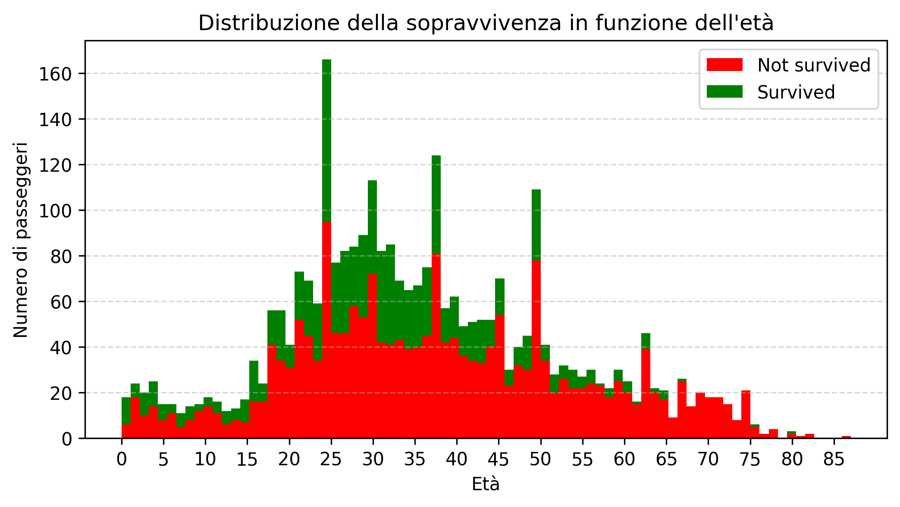 
            <i>Figura 4.1: Distribuzione della sopravvivenza per età dei passeggeri</i>
        </td>
    </tr>
</table>

Nei due grafici sono considerati solamente i valori di età effettivamente disponibili nel dataset, escludendo quelli inseriti durante la fase di preprocessing. Questa scelta è stata adottata per evitare che i valori inseriti artificialmente potessero alterare la distribuzione reale dei dati. L'analisi dell’età permette inoltre di osservare come la popolazione dei passeggeri sia distribuita principalmente nelle fasce di età adulte, con una presenza minore di bambini e anziani.

## Metodologia
Per affrontare il problema della predizione della sopravvivenza dei passeggeri, sono stati progettati, addestrati e confrontati quattro modelli di classificazione: regressione logistica, Multi-Layer Perceptron (MLP), classificatore softmax e Support Vector Machine (SVM).
In questa sezione vengono descritte le architetture dei modelli, le funzioni di loss adottate, le principali scelte progettuali e le metriche di riferimento utilizzate per la valutazione delle prestazioni dei modelli.

Il regressore logistico è un modello di classificazione binaria che, date in input le feature, restituisce la probabilità di appartenenza alla classe positiva (sopravvissuto). Dall'analisi del dataset (`dataset_stats.ipynb`) è emerso uno sbilanciamento delle classi: circa due terzi dei passeggeri apparteneva alla classe `0` (non sopravvissuto) e un terzo alla classe `1` (sopravvissuto).

Per gestire questo squilibrio, sono stati addestrati due modelli distinti utilizzando due funzioni di loss: `BCELoss` e `BCEWithLogitsLoss`. La seconda integra internamente la funzione sigmoide, garantendo maggiore stabilità numerica, e permette inoltre di applicare il parametro `pos_weight` per penalizzare maggiormente gli errori sulla classe minoritaria, migliorando così il recall.

L'architettura adottata consiste in un singolo strato lineare con 5 input feature e 1 output. Nel primo modello viene applicata la funzione di attivazione sigmoide all'output, mentre nel secondo vengono usati i logits direttamente per la loss.

Questo sbilanciamento nelle etichette del dataset è stato anche affrontato anche nei modelli di Multi-Layer Perceptron, classificatore softmax e Support Vector Machine. Per mitigare il problema, in ciascun modello è stato applicato il parametro `weight` nella funzione di loss.

I pesi sono stati assegnati in maniera tale che la classe positiva, meno rappresentata, ricevesse un peso maggiore (`2.0`), mentre la classe negativa riceve un peso unitario (`1.0`). In questo modo, l'errore commesso nel classificare un esempio di classe positiva contribuisce doppiamente alla loss rispetto ad un esempio di classe negativa, spingendo il modello a riconoscere meglio la classe rara e a non predire esclusivamente la classe negativa per minimizzare la loss complessiva.

Il Multi-layer Perceptron (MLP) è una rete neurale in grado di catturare relazioni non lineari tra le feature tramite l'utilizzo di più strati nascosti ed è utilizzato per effettuare classificazione multi-classe.

Sono stati addestrati due modelli distinti: un MLP base a due strati e un MLP profondo con diversi strati nascosti. L'architettura dei due modelli prevede per l'MLP base un primo strato lineare da 5 neuroni di input a 3 intermedi e nel secondo strato da 3 a 2 neuroni di output. Per l'MLP profondo è invece utilizzata un'architettura a strati 5 -> 16 -> 8 -> 4 -> 2.
Entrambi i modelli utilizzano la ReLU come funzione di attivazione tranne nell'ultimo strato poiché la funzione di loss adottata è la `CrossEntropyLoss` ovvero una generalizzazione multiclasse della `BCELoss` e richiede logits come input.

Il classificatore softmax rappresenta una versione più semplice dell'MLP per la classificazione multi-classe, essendo costituito da un solo strato lineare che mappa le 5 feature di input a 2 in output. Anche in questo caso è stata utilizzata la funzione di loss `CrossEntropyLoss`; di conseguenza, non è stata applicata esplicitamente la funzione softmax nel modello, poiché essa è già inclusa nella funzione di loss.

L'ultimo modello considerato è il Support Vector Machine (SVM), un modello di classificazione binaria che individua un iperpiano in grado di separare i dati massimizzando il margine tra le due classi. I vettori di supporto sono i punti più vicini a tale margine e contribuiscono in modo determinante alla definizione della frontiera decisionale.

L'equazione dell'iperpiano è $w * x + b = 0$, dove $w$ il vettore dei pesi, $x$ il vettore delle feature in input e $b$ il termine di bias. Coerentemente con questa formulazione, il modello è stato implementato come uno strato lineare con 5 feature in input e 2 in output.

Per poter addestrare correttamente l'SVM, le etichette sono state trasformate da `0` a `-1` per la classe negativa, mantenendo `1` per la classe positiva. La funzione di loss utilizzata è la hinge loss:

$$
L = \max(0, 1 - y * f(x))
$$

dove $y$ è l'etichetta e $f(x)$ il valore predetto dal modello. Se il punto è classificato correttamente con un margine sufficiente, la loss è nulla; se si trova all'interno del margine, la penalizzazione è ridotta; mentre in caso di classificazione errata la loss aumenta significativamente.

Questo modello è stato inoltre confrontato con l'implementazione SVM fornita dalla libreria `scikit-learn`.

Tutti I modelli trattati sono stati addestrati utilizzando l'ottimizzatore SGD (Stochastic Gradient Descent).
Gli iperparametri scelti sono il learning rate pari a `0.05`, un `momentum` pari a `0.9`, utile per accelerare la convergenza sfruttando l'informazione dei gradienti passati, e una regolarizzazione L2 ottenuta tramite il parametro `weight_decay` impostato a `0.001`.

I dati sono stati elaborati con la classe `DataLoader`, utilizzando mini-batch da 32 elementi per il training set e da 64 per il test set. Durante l'addestramento, i dati di training sono stati mescolati ad ogni epoca tramite il flag `shuffle = True` per migliorare la generalizzazione del modello.

## Esperimenti
In questa sezione vengono presentate le procedure di addestramento e validazione adottate, insieme ad un confronto tra i diversi modelli e ad un'analisi dei risultati ottenuti. L'obiettivo degli esperimenti è valutare le capacità dei modelli di generalizzare sui dati di test, con particolare attenzione alla classe positiva, meno rappresentata dal dataset.

I dati sono stati suddivisi in training e test set, successivamente normalizzati e organizzati in mini-batch, come descritto nelle sezioni precedenti. Tutti i modelli sono stati addestrati per 300 epoche, durante le quali, per ogni epoca, sono stati eseguiti due cicli principali:
- Training: per ogni batch del training set vengono calcolate la loss e l'accuracy, aggiornando i parametri del modello tramite ottimizzazione. Al termine di ciascuna epoca, sono stati calcolati i valori medi di loss e accuracy sull'intero training set.
- Validazione: senza aggiornare i parametri del modello, vengono calcolate la loss e l'accuracy su ogni batch nel test set, e successivamente i valori medi complessivi.

Al termine dell’addestramento, i modelli sono stati valutati tramite diverse metriche:
- Accuracy: indica la percentuale di classificazioni corrette sul totale degli esempi.
- Precision: rappresenta la proporzione di esempi classificati correttamente come positivi che risultano effettivamente positivi.
- Recall: misura la proporzione di esempi positivi correttamente identifcati rispetto al totale dei positivi reali.
- F1-score: costituisce la media armonica tra precision e recall e fornisce una valutazione bilanciata delle prestazioni del modello.

Inoltre, per i modelli direttamente confrontabili tra loro, come le due versioni della regressione logistica e i modelli Multi-Layer Perceptron, è stato riportato anche il valore della loss sul test set, al fine di valutare le prestazioni in termini di loss media.

Nel contesto considerato, caratterizzato da uno sbilanciamento tra le classi, metriche come recall ed F1-score risultano più informative rispetto alla sola accuracy. Esse permettono infatti di valutare in modo più accurato le prestazioni sulla classe positiva.

Per i modelli di regressione logistica sono state calcolate tutte le metriche sopra descritte. 

    <table>
        <thead>
            <tr>
                <th>Modello</th>
                <th>Loss</th>
                <th>Accuracy</th>
                <th>Precision</th>
                <th>Recall</th>
                <th>F1-Score</th>
            </tr>
        </thead>
        <tbody>
            <tr>
                <td>Logistic</td>
                <td>0.6155</td>
                <td>66.58%</td>
                <td>37.93%</td>
                <td>4.40%</td>
                <td>7.89%</td>
            </tr>
            <tr>
                <td>LogisticLogits</td>
                <td>0.8940</td>
                <td>54.62%</td>
                <td>39.45%</td>
                <td>74.00%</td>
                <td>51.46%</td>
            </tr>
        </tbody>
    </table>
    <i>Tabella 2: Metriche di valutazione della regressione logistica</i>

Il confronto, riportato in **Tabella 2**, evidenzia come il modello base, pur ottenendo un'accuracy più elevata, presenti un recall estremamente basso, indicando una forte tendenza a classificare gli esempi come appartenenti alla classe negativa.

L'introduzione del parametro `pos_weight` nella funzione di loss `BCEWithLogitsLoss` consente di bilanciare l'importanza delle classi, portando ad un miglioramento significativo del recall e dell'F1-score. Questo comportamento evidenzia una maggiore capacità del modello di identificare la classe positiva, a discapito di una riduzione dell'accuracy complessiva.

Si osserva inoltre un aumento del valore della loss, dovuto al fatto che gli errori di classificazione sulla classe positiva vengono penalizzati maggiormente. Di conseguenza, il valore medio della loss risulta più elevato, riflettendo l'enfasi posta sul corretto riconoscimento della classe meno rappresentata.

Nei modelli Multi-layer Perceptron, il bilanciamento delle classi è stato ottenuto tramite il parametro `weight` nella funzione di loss `CrossEntropyLoss`.

    <table>
        <thead>
            <tr>
                <th>Modello</th>
                <th>Loss</th>
                <th>Accuracy</th>
                <th>Precision</th>
                <th>Recall</th>
                <th>F1-Score</th>
            </tr>
        </thead>
        <tbody>
            <tr>
                <td>MLP_2Layer</td>
                <td>0.6285</td>
                <td>60.73%</td>
                <td>43.72%</td>
                <td>72.40%</td>
                <td>54.52%</td>
            </tr>
            <tr>
                <td>DeepMLP</td>
                <td>0.5923</td>
                <td>62.29%</td>
                <td>45.35%</td>
                <td>78.00%</td>
                <td>57.35%</td>
            </tr>
        </tbody>
    </table>
    <i>Tabella 3: Metriche di valutazione dei Multi-Layer Perceptron</i>

I risultati mostrano che il modello più profondo, come riportato in **Tabella 3**, ottiene prestazioni migliori rispetto a quello base, con una loss inferiore e valori più elevati di accuracy, recall ed F1-score. Questo suggerisce una maggiore capacità di apprendere relazioni non lineari e una migliore generalizzazione sui dati di test.

Il classificatore softmax, pur utilizzando lo stesso schema di bilanciamento, mostra prestazioni intermedie, come evidenziato in **Tabella 4**, con valori inferiori rispetto agli MLP ma comunque significativamente migliori rispetto ai modelli non bilanciati.

    <table>
        <thead>
            <tr>
                <th>Modello</th>
                <th>Accuracy</th>
                <th>Precision</th>
                <th>Recall</th>
                <th>F1-Score</th>
            </tr>
        </thead>
        <tbody>
            <tr>
                <td>Softmax</td>
                <td>59.69%</td>
                <td>41.48%</td>
                <td>58.40%</td>
                <td>48.50%</td>
            </tr>
        </tbody>
    </table>
    <i>Tabella 4: Metriche di valutazione del classificatore Softmax</i>

Per quanto riguarda l'SVM implementato manualmente, il bilanciamento è stato introdotto direttamente nella funzione di loss tramite pesi sulle classi.

    <table>
        <thead>
            <tr>
                <th>Modello</th>
                <th>Accuracy</th>
                <th>Precision</th>
                <th>Recall</th>
                <th>F1-Score</th>
            </tr>
        </thead>
        <tbody>
            <tr>
                <td>LinearSVM</td>
                <td>59.69%</td>
                <td>38.97%</td>
                <td>42.40%</td>
                <td>40.61%</td>
            </tr>
            <tr>
                <td>SVM sklearn</td>
                <td>67.49%</td>
                <td>0.00%</td>
                <td>0.00%</td>
                <td>0.00%</td>
            </tr>
        </tbody>
    </table>
    <i>Tabella 5: Metriche di valutazione dei Support Vector Machine</i>

Questo approccio consente al modello di riconoscere una porzione significativa della classe positiva, sebbene con prestazioni inferiori rispetto ai modelli neurali.

Infine, il modello SVM della libreria `scikit-learn`, privo di bilanciamento delle classi, mostra un'accuracy elevata ma un recall nullo, indicando che il modello tende a predire esclusivamente la classe negativa. Questo comportamento rende il modello inadeguato per il problema considerato.

L'andamento dell'addestramento dei modelli è stato analizzato tramite i grafici di loss e accuracy ottenuti mediante TensorBoard.

In particolare, sono stati considerati i seguenti grafici:
- la loss in training e test al variare delle epoche;
- l'accuracy in training e test al variare delle epoche.

Dall'analisi dei grafici riportati in **Figura 5** e **Figura 5.1** (si rimanda all'appendice per la corrispondenza tra colori e modelli) si osserva che la maggior parte dei modelli presenta un andamento della loss relativamente stabile nel corso delle epoche, indicando una rapida convergenza. In alcuni casi, come nel modello DeepMLP, si nota una riduzione più marcata della loss nelle fasi iniziali dell'addestramento, seguita da una progressiva stabilizzazione.

<table align="center">
    <tr>
        <td align="center">
            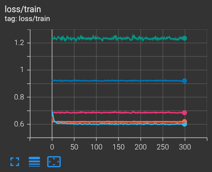 
            <i>Figura 5: Grafico dell'andamento della loss in training di tutti i modelli</i>
        </td>
        <td align="center">
            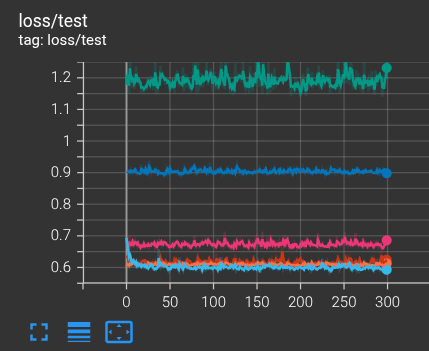 
            <i>Figura 5.1: Grafico dell'andamento della loss in test di tutti i modelli</i>
        </td>
    </tr>
</table>

La stabilità osservata delle curve di loss suggerisce una convergenza rapida dei modelli; tuttavia, dalle metriche riportate nelle tabelle precedenti emerge come tale convergenza avvenga verso prestazioni complessivamente moderate. Questo comportamento può essere attribuito sia alla relativa semplicità delle architetture adottate, sia al numero limitato e alla natura delle feature utilizzate, che potrebbero non essere sufficienti a catturare tutte le relazioni necessarie per una predizione più accurata della sopravvivenza dei passeggeri.

Il confronto tra i modelli evidenzia come l'utilizzo di tecniche di bilanciamento delle classi sia fondamentale in presenza di dataset sbilanciati. I modelli non bilanciati, come la regressione logistica base e l'SVM implementato tramite `scikit-learn`, tendono infatti a predire quasi esclusivamente la classe negativa, ottenendo valori di accuracy elevati ma recall molto basso o nullo. L'introduzione di pesi nella funzione di loss consente invece di migliorare significativamente la capacità dei modelli di riconoscere la classe positiva, come dimostrato dall'aumento di recall e dell'F1-score.

Tra tutti i modelli analizzati, il DeepMLP risulta il più efficace, in quanto raggiunge il miglior compromesso tra accuracy, recall ed F1-score, oltre a presentare una loss inferiore rispetto ad altri modelli neurali. Ciò indica una maggiore capacità di apprendere relazioni non lineari tra le feature e di generalizzare sui dati di test.

<table align="center">
    <tr>
        <td align="center">
            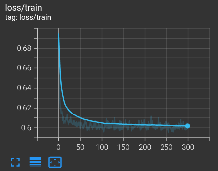 
            <i>Figura 6: Grafico dell'andamento della loss in training del modello DeepMLP</i>
        </td>
        <td align="center">
            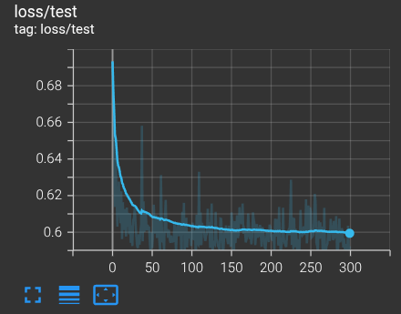 
            <i>Figura 6.1: Grafico dell'andamento della loss in test del modello DeepMLP</i>
        </td>
    </tr>
</table>

<table align="center">
    <tr>
        <td align="center">
            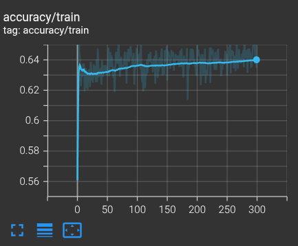 
            <i>Figura 7: Grafico dell'andamento dell'accuracy in training del modello DeepMLP</i>
        </td>
        <td align="center">
            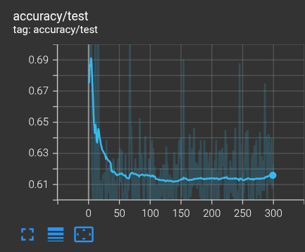 
            <i>Figura 7.1: Grafico dell'andamento dell'accuracy in test del modello DeepMLP</i>
        </td>
    </tr>
</table>

Dal punto di vista dei grafici in **Figura 6** e **Figura 6.1**, il modello DeepMLP mostra un andamento stabile della loss, senza divergenze significative tra training e test. Questo comportamento suggerisce un buon equilibrio tra bias e varianza e non evidenzia fenomeni rilevanti di overfitting. 

Per quanto riguarda l'accuracy, si osserva, nella **Figura 7.1**, che nel test set essa assume inizialmente valori più elevati, per poi diminuire nelle prime epoche e stabilizzarsi successivamente. Questo andamento può essere dovuto al fatto che, nelle fasi iniziali, il modello non abbia ancora appreso una rappresentazione significativa dei dati e può ottenere prestazioni apparentemente elevate per effetto dello sbilanciamento delle classi, predicendo prevalentemente la classe negativa. Con il progredire dell'addestramento, il modello modifica il proprio comportamento, migliorando la capacità di identificare la classe positiva, con un conseguente aumento degli errori complessivi ma una classificazione più bilanciata tra le classi.

## Demo
Per dimostrare il funzionamento del modello migliore di classificazione selezionato come migliore sulla base delle analisi precedenti, è stata sviluppata una semplice applicazione con interfaccia grafica che consente di eseguire inferenza sui dati in maniera interattiva.

L'interfaccia grafica è stata implementata in Python utilizzando la libreria `Tkinter`, scelta per la sua leggerezza e per la facilità di integrazione con codice Python. La demo è stata progettata seguendo un'approccio modulare, suddividendo il codice in più files, ciascuno con una responsabilità ben definita, al fine di migliorare la leggibilità del codice.

In particolare, l'organizzazione della demo è la seguente:
- `data.py`: gestisce il caricamento del dataset, la suddivisione in training e test set e la normalizzazione delle feature.
- `model.py`: contiene la definizione del modello **DeepMLP**, la funzione di predizione, e la funzione per il caricamento dello stato del modello precedentemente addestrato.
- `train.py`: implementa la procedura di addestramento del modello e il salvataggio dello stato di esso su file.
- `controller.py`: rappresenta il livello di collegamento tra interfaccia grafica e il modello. Contiene le funzioni per il caricamento del dataset, la selezione degli esempi e l'esecuzione della predizione.
- `gui.py`: definisce l'interfaccia grafica e i principali elementi visivi, quali etichette e pulsanti.
- `main.py`: funge da punto di ingresso dell'applicazione, occupandosi di addestrare o caricare il modello e avviare la GUI.

La demo, denominata "Passenger Survival Predictor", è mostrata in **Figura 8**. Essa consente di caricare il dataset in formato CSV contenente esempi relativi ai disastri navali storici, ottenuto tramite il processo di integrazione descritto nel notebook `merge_dataset.ipynb`. Il dataset viene utilizzato come sorgente di input, mentre l'inferenza viene eseguita su un singolo esempio alla volta.

    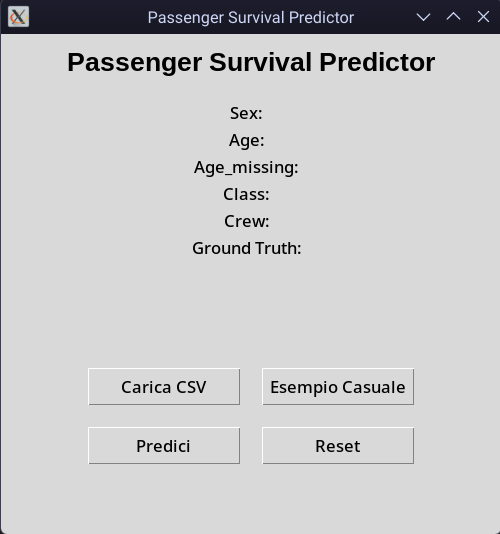
     
    <i>Figura 8: Interfaccia principale della demo</i>

Come illustrato in **Figura 8**, l'interfaccia mette a disposizione diversi comandi che guidano l'utente nel flusso di utilizzo:
- un pulsante per il caricamento del dataset (**Figura 8.1**);
- un pulsante per la selezione casuale di un esempio dal dataset (**Figura 8.2**);
- un pulsante per l'esecuzione della predizione (**Figura 8.3**);
- un pulsante di reset, che consente di ripristinare lo stato iniziale dell'applicazione.

<table align="center">
    <tr>
        <td align="center">
            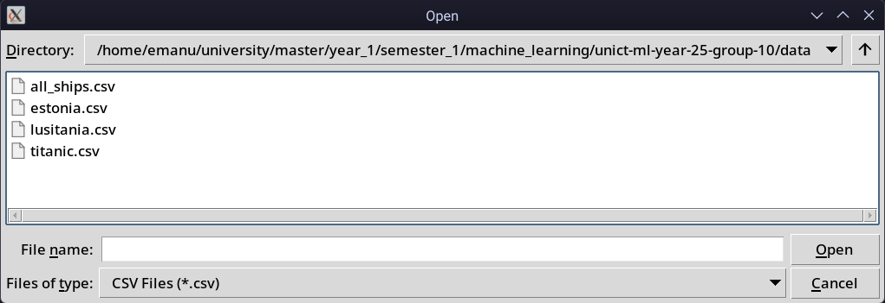 
            <i>Figura 8.1: Caricamento del dataset in formato CSV nell'interfaccia della demo</i>
        </td>
        <td align="center">
            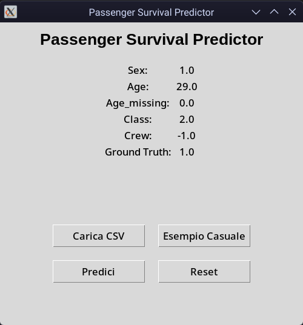 
            <i>Figura 8.2: Selezione casuale di un esempio dal dataset caricato</i>
        </td>
        <td align="center">
            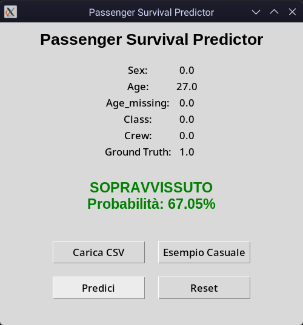 
            <i>Figura 8.3: Visualizzazione del risultato della predizione</i>
        </td>
    </tr>
</table>

Una volta selezionato un campione, le relative feature, quali sesso, età, indicatore di valore mancante per l'età, classe e appartenenza all'equipaggio, vengono mostrate tramite componenti di sola lettura. Questa scelta progettuale garantisce coerenza con il preprocessing adottato in fase di training ed evita modifiche manuali che potrebbero introdurre input non validi. Inoltre, viene visualizzata l'etichetta di ground truth, consentendo un confronto diretto tra il valore reale e la predizione del modello.

La funzione di predizione utilizza il modello addestrato per stimare la probabilità di sopravvivenza del passeggero. Il risultato viene mostrato sotto forma di etichetta testuale, indicando sia la classe predetta (sopravvissuto / non sopravvissuto) sia la probabilità associata. In questo modo, l'utente può valutare non solo la decisione del modello, ma anche il grado di confidenza della predizione.

Le immagini riportate in **Figura 8** e nelle relative sottofigure consentono di evidenziare il funzionamento complessivo della demo e l'integrazione tra modello e interfaccia grafica, mostrando chiaramente il flusso operativo: caricamento dei dati, selezione dell'input e generazione della predizione.

## Conclusioni
In questo lavoro sono stati sviluppati e confrontati diversi modelli di classificazione per la predizione della sopravvivenza dei passeggeri nei disastri navali storici, utilizzando un dataset integrato costruito a partire da tre dataset distinti.

I risultati sperimentali evidenziano come le prestazioni dei modelli dipendano fortemente dalla gestione dello sbilanciamento delle classi. I modelli non bilanciati, come la regressione logistica base e l'SVM implementato tramite `scikit-learn`, tendono a privilegiare la classe maggioritaria, ottenendo valori di accuracy relativamente elevati ma recall estremamente basso o nullo.

L'introduzione di tecniche di bilanciamento, come l'utilizzo di pesi nelle funzioni di loss (`pos_weight` o `weight`), ha portato ad un miglioramento significativo nella capacità di riconoscere la classe positiva. In particolare:
- la regressione logistica con `BCEWithLogitsLoss` ha migliorato drasticamente il recall, a discapito dell'accuracy;
- i modelli MLP hanno mostrato le migliori prestazioni complessive;
- il modello **DeepMLP** si è dimostrato il più efficace, raggiungendo il miglior compromesso tra accuracy, recall ed F1-score.

Nel complesso, i risultati indicano che modelli più complessi, se opportunamente bilanciati, sono in grado di catturare relazioni non lineari tra le feature e migliorare la capacità predittiva rispetto ai modelli lineari.

Il contributo principale del progetto consiste nella costruzione di un dataset unificato a partire da fonti eterogenee e nella valutazione sistematica dell'impatto dello sbilanciamento delle classi sulle prestazioni dei modelli di classificazione.

Inoltre, il lavoro evidenzia come metriche di recall ed F1-score siano fondamentali in contesti reali in cui la classe di interesse è minoritaria, mostrando i limiti dell'accuracy come unica misura di valutazione.

Dal punto di vista applicativo, il progetto dimostra come tecniche di Machine Learning possano essere utilizzate per analizzare eventi storici complessi, trasformando informazioni qualitative in modelli quantitativi interpretabili.

Tra le possibili estensioni del lavoro si individuano diverse direzioni. In primo luogo, sarebbe possibile arricchire il dataset con nuove feature, ad esempio introducendo informazioni temporali o contestuali. Inoltre, si potrebbero adottare tecniche di feature engineering più avanzate al fine di migliorare la rappresentazione dei dati.

Dal punto di vista modellistico, risulterebbe interessante sperimentare architetture più complesse, come metodi ensemble, e ottimizzare gli iperparametri mediante tecniche di ricerca automatica. Un ulteriore miglioramento potrebbe derivare dall'utilizzo di tecniche di bilanciamento dei dati, come oversampling o undersampling.

Infine, l'analisi potrebbe essere estesa includendo ulteriori disastri navali o dataset simili, al fine di valutare la capacità di generalizzazione dei modelli su scenari differenti.

## Appendici
In questa sezione sono riportati materiali aggiuntivi a supporto delle analisi presentate nel corpo principale della relazione.

In particolare sono inclusi un'immagine che riporta la corrispondenza tra i colori e i modelli su TensorBoard e i grafici completi dell'andamento dell'accuracy in training e test di tutti i modelli addestrati.

<table align="center">
    <tr>
        <td align="center">
            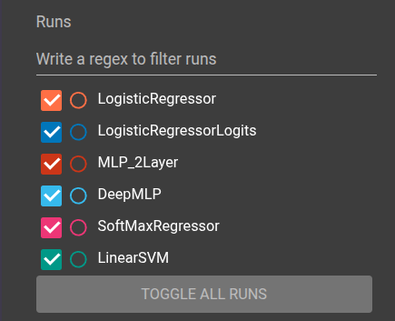 
            <i>Figura x: Corrispondenza tra i colori e i modelli nei grafici su TensorBoard</i>
        </td>
        <td align="center">
            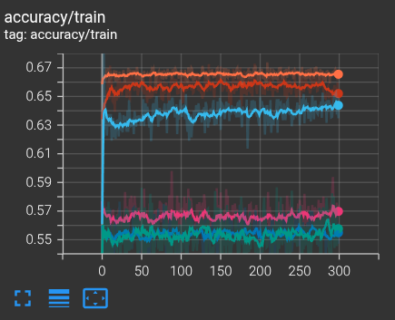 
            <i>Figura x: Grafico dell'andamento dell'accuracy in training di tutti i modelli</i>
        </td>
        <td align="center">
            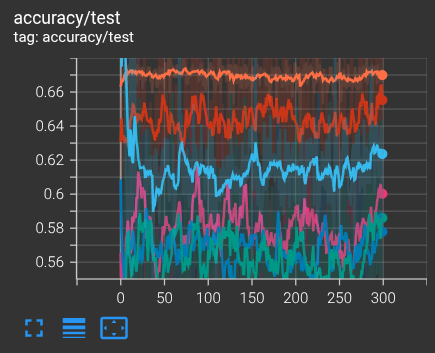 
            <i>Figura x: Grafico dell'andamento dell'accuracy in test di tutti i modelli</i>
        </td>
    </tr>
</table>

## Riferimenti
### Dataset e risorse online
- RMS Titanic Dataset, Kaggle: https://www.kaggle.com/datasets/abdelrahmansaad10/titanic
- MS Estonia Dataset, Kaggle: https://www.kaggle.com/datasets/christianlillelund/passenger-list-for-the-estonia-ferry-disaster
- RMS Lusitania Dataset, Kaggle: https://www.kaggle.com/datasets/rkkaggle2/rms-lusitania-complete-passenger-manifest

### Strumenti e librerie utilizzati
- Python: https://www.python.org/
- PyTorch: https://pytorch.org
- Scikit-learn: https://scikit-learn.org
- Pandas: https://pandas.pydata.org
- NumPy: https://numpy.org
- TensorBoard: https://www.tensorflow.org/tensorboard
